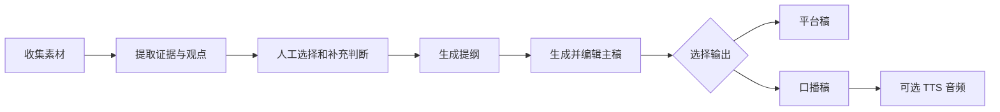

# HCDS Studio

证据驱动的 AI 内容工作台。

HCDS Studio 面向个人创作者和小团队，把资料收集、观点研究、证据筛选、提纲与正文生成、版本管理和多形态发布放进同一个项目工作区，让 AI 不只是“帮你写一段话”，而是参与一条可追溯、可校对、可持续积累的内容生产流程。

## 项目卖点

### 1. 从素材直接进入创作

粘贴原始资料、导入音视频转录，或从播客中提取观点。不同来源最终都汇入同一个内容项目，不必在文档、播放器和聊天窗口之间反复搬运。

### 2. 先选证据，再让 AI 动笔

系统会从来源快照中提取可核验的证据卡。你可以选择、拒绝、修正证据，并补充自己的经验与判断；AI 生成提纲和正文时只使用当前有效的创作上下文，减少“写得顺，但没有依据”的内容。

### 3. 每个结论都能回到原文

证据保留原文片段、位置和来源哈希，稿件引用保存独立快照。即使来源后来被移出项目或证据发生修正，历史稿件仍能说明当时引用了什么。

### 4. 创作过程不会被覆盖

提纲、主稿、平台稿和口播稿都以不可变 Revision 保存。每次显式保存都会产生新版本，方便回看创作路径，也避免 AI 重写或误操作覆盖已有成果。

### 5. 一份研究，多种输出

同一套来源和证据可以继续生成提纲、长文、小红书或微信公众号结构、口播稿，并按需进入 TTS。音频是内容资产的一种 Render，不再是项目的唯一主线。

### 6. 数据与模型都由自己掌控

项目默认使用本地 SQLite 保存内容资产，支持配置 Anthropic / OpenAI 兼容 LLM、MiMo TTS / ASR，以及 Mac 或 WSL 局域网 ASR。外部模型负责生成，本地系统负责保存事实、版本和任务状态。

## 核心工作流



## 你可以用它做什么

- 把文章、笔记和访谈素材整理成一篇有引用依据的长文。
- 转录单个或整批音视频，并把文本沉淀为可复用的内容来源。
- 从播客逐字稿中提取嘉宾观点，比较共识与分歧，再组织进新选题。
- 围绕 Brief、受众、目标、角度和语气生成提纲与初稿。
- 保留每次稿件修订和引用快照，在多个版本之间继续创作。
- 将定稿改造成平台内容、口播稿或带自定义音色的音频。

## 主要功能

| 模块 | 能力 |
| --- | --- |
| 工作台 | 创建内容项目，维护 Brief、来源、证据、提纲与稿件 |
| 内容库 | 管理项目、转录结果、文字成稿与音频 Render |
| 研究 | 音视频转录、播客结构化阅读、观点提取与关系分析 |
| AI 创作 | 证据提取、提纲草案、主稿草案和平台结构生成 |
| 版本与引用 | 不可变 Revision、来源快照、证据卡与历史 Citation |
| 音频 | 口播稿分段精修、TTS、音色设计、音色克隆与试听 |
| 长任务 | 持久化 Job、实时进度、失败重试与重复请求收敛 |

> 自动化页面目前保留配置与运行状态展示，但尚未接入真实内容生产执行器，因此不会把“保存了 cron”显示成“业务已执行”。

## 快速开始

### 环境要求

- Node.js 20（最低支持版本由启动脚本检查）
- npm
- 至少一个可用的 LLM API Key
- 如需转录或生成音频，再配置对应的 ASR / TTS 服务

### 安装

```bash
git clone https://github.com/Fragtex254/hcds-studio.git
cd hcds-studio

cd backend && npm install
cd ../frontend && npm install
```

在 `backend/` 下创建 `.env`：

```env
PORT=3001
NODE_ENV=development
HOST=127.0.0.1
# CORS_ORIGINS=https://studio.example
```

模型、API Key、Base URL 和提示词可在应用的「设置」中配置，并持久化到本地 SQLite。

后端默认只监听 `127.0.0.1`，浏览器跨域白名单默认仅包含 `http://localhost:5173` 与 `http://127.0.0.1:5173`。`CORS_ORIGINS` 接受逗号分隔的附加来源，不会替换这两个本机来源。

如确需从局域网访问，可显式设置 `HOST=0.0.0.0`，并把实际前端地址（例如 `http://192.168.1.20:5173`）加入 `CORS_ORIGINS`。本项目当前没有账号与鉴权边界；只应在可信局域网和受控防火墙内这样运行，禁止把服务端口直接暴露到公网。

### 启动

```bash
./start.sh
```

启动后访问：

- 前端：<http://localhost:5173>
- 后端：<http://localhost:3001>

停止前台服务可在启动终端按 `Ctrl+C`；如有残留进程，可运行：

```bash
./shutdown.sh
```

## 技术栈

| 层 | 技术 |
| --- | --- |
| 前端 | React 19、TypeScript、Vite 8、Tailwind CSS 4、Zustand、React Router 7 |
| 后端 | Node.js、Express 5、better-sqlite3、Jest、SSE |
| AI / 音频 | Anthropic / OpenAI 兼容 LLM、MiMo TTS / ASR、本地或局域网 ASR、FFmpeg |
| 工程化 | GitHub Actions、ESLint、Vitest、supertest |

## 常用开发命令

后端：

```bash
cd backend
npm run dev
npm test -- --runInBand
```

前端：

```bash
cd frontend
npm run dev
npm run lint
npm run build
npm run test
```

## 项目结构

```text
hcds-studio/
├── backend/             # API、业务服务、任务编排、SQLite DAL
├── frontend/            # 内容工作台、内容库、音色库、自动化与设置
├── docs/                # 产品、架构、ASR、播客研究等文档
├── start.sh             # 一键启动前后端
├── shutdown.sh          # 清理项目相关服务
├── AGENTS.md            # Agent 开发入口与硬性约束
└── README.md
```

## 进一步了解

- [项目事实与技术约定](docs/project-facts.md)
- [内容工作台架构](docs/content-workbench-architecture.md)
- [证据驱动创作闭环](docs/evidence-driven-creation-loop.md)
- [播客研究能力](docs/podcast-research.md)
- [ASR 配置与说明](docs/asr.md)

## 许可证

ISC License
