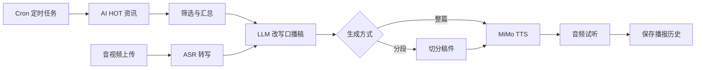

# TTS Broadcast

把每天的 AI 资讯变成一段可以直接收听的中文播报。

TTS Broadcast 是一个面向个人和小团队的 AI 新闻播报工作台：它从 AI HOT 拉取每日资讯，用 LLM 改写成更适合口播的稿件，再通过 MiMo TTS 生成音频。你可以手动编辑稿件、分段生成长音频、管理音色预设、上传音视频转写，也可以把整条流程交给定时任务自动运行。


## 为什么做这个

每天都有太多 AI 资讯，但真正值得听完、转发、复盘的内容需要被筛选、改写和包装。这个项目把“找资讯 -> 写口播稿 -> 试音色 -> 生成音频 -> 保存归档”的链路放进一个本地全栈应用里，让日报、播客片段、内部分享和语音内容生产变得更轻。

## 核心能力

- **资讯采集**：从 AI HOT 获取每日 AI 新闻，支持分类与数量控制。
- **稿件改写**：使用可配置 LLM 将资讯改写为中文口播稿，支持自定义开场白、结束语和系统提示词。
- **整篇/分段 TTS**：短稿可一键生成，长稿可切分成多个片段分别合成，降低失败成本。
- **音色工作流**：支持预设音色、音色克隆、音色设计、试听音频和音色预设管理。
- **音视频转写**：上传音频或视频，后端自动转码、切片并通过 ASR 输出文本，适合把素材快速变成稿件来源。支持批量转录：选择文件夹自动遍历子目录，勾选需要转录的文件，串行转录后每篇单独保存，可一键打包下载 ZIP 压缩包。
- **定时播报**：使用 cron 表达式配置自动任务，定期抓取、改写并生成播报。
- **历史与资产管理**：保存播报记录、音频文件、分段状态和生成参数，支持回放与清理策略。
- **实时进度**：长任务通过 SSE 推送开始、进度、完成和失败状态，前端可持续反馈。

## 工作流



## 技术栈

| 层 | 技术 |
| --- | --- |
| 后端 | Node.js, Express 5, better-sqlite3, Jest, node-cron |
| AI / 音频 | MiMo TTS, MiMo ASR, Anthropic/OpenAI 兼容 LLM 接口, ffmpeg-static |
| 前端 | React 19, TypeScript, Vite 8, Tailwind CSS 4, Zustand, React Router 7, Zod |
| 工程化 | GitHub Actions, ESLint, Vitest, supertest |

## 快速开始

### 1. 准备环境

- Node.js 20 推荐；本地启动脚本最低检查 Node.js 18
- npm
- MiMo API Key

### 2. 安装依赖

```bash
git clone https://github.com/Fragtex254/tts-broadcast.git
cd tts-broadcast

cd backend
npm install

cd ../frontend
npm install
```

### 3. 配置服务与 API Key

在 `backend/` 下创建 `.env`，用于服务级配置：

```env
PORT=3001
NODE_ENV=development
```

启动应用后，在设置页填写 LLM API Key、TTS/ASR API Key、LLM base URL、模型和提示词等运行时设置。它们会持久化到 SQLite，不需要写进 `.env`。

### 4. 启动应用

推荐使用一键启动脚本：

```bash
./start.sh
```

也可以手动启动：

```bash
cd backend
npm run dev
```

```bash
cd frontend
npm run dev
```

启动后访问：

- 前端：http://localhost:5173
- 后端：http://localhost:3001

## 常用命令

后端：

```bash
cd backend
npm run dev
npm test -- --runInBand
```

前端：

```bash
cd frontend
npm run dev
npm run lint
npm run build
npm run test
```

## 项目结构

```text
tts-broadcast/
├── backend/
│   ├── src/
│   │   ├── app.js              # Express 应用入口
│   │   ├── db/                 # SQLite 初始化与 schema
│   │   ├── routes/             # HTTP 路由
│   │   ├── services/           # 业务逻辑、外部 API、DAL 与任务编排
│   │   └── utils/              # 共享工具
│   ├── tests/                  # Jest + supertest 测试
│   ├── audio/                  # 生成音频，已 gitignore
│   └── data/                   # SQLite 数据库，已 gitignore
├── frontend/
│   ├── src/
│   │   ├── pages/              # SourceCollection, ScriptEditor, Transcribe, History, Settings
│   │   ├── components/         # 可复用 UI 和工作台组件
│   │   ├── services/           # API、SSE、错误处理与 schema 校验
│   │   └── store/              # Zustand slices
├── docs/                       # 项目事实、设计文档和外部 API 资料
├── start.sh
├── AGENTS.md                   # Agent 开发入口规范
└── README.md
```

## 主要 API

后端接口统一挂载在 `/api` 下。常用资源包括：

| 资源 | 用途 |
| --- | --- |
| `/api/broadcast/*` | 获取资讯、改写稿件、生成音频、保存历史、获取播报详情 |
| `/api/segments/*` | 分段稿件、分段 TTS 和片段状态管理 |
| `/api/transcribe/*` | 音视频上传、ASR 转写、批量转录（文件夹遍历）和任务进度 |
| `/api/settings/*` | API Key、LLM、TTS、提示词和默认偏好设置 |
| `/api/schedules/*` | 定时任务的创建、更新、启停和删除 |
| `/api/voice-presets/*` | 克隆/设计音色预设与试听资产管理 |
| `/api/sse/:taskId` | 长任务实时事件流 |

更完整的接口、数据模型和外部 API 背景见 [docs/project-facts.md](docs/project-facts.md)。

## 数据与文件

项目使用 SQLite 作为本地持久化层，主要保存播报、分段、设置、定时任务和音色预设。生成音频写入 `backend/audio/`，数据库文件写入 `backend/data/`，这两个目录都不会提交到 Git。

音频生命周期由后端统一管理：

- 未保存音频只保留最近 10 条。
- 已保存音频最多保留 50 条，超出后淘汰最旧记录。
- 删除音频统一走受保护的文件清理逻辑，避免误删任意路径。

## 开发约定

仓库根目录的 `CLAUDE.md` 是 `AGENTS.md` 的 symlink，所有 agent 开发任务都从这里读取规则。关键约束包括：

- 后端路由只做 HTTP 翻译，不直接写 SQL。
- 数据访问通过 `services/*Store.js` 等 DAL 层。
- 外部 API 测试必须 mock，不依赖真实网络或真实业务密钥。
- 长任务必须有 loading/error 状态；已接入 SSE 的任务必须推送开始、进度、完成和失败事件。
- 新增持久化字段要同步 schema、迁移、后端返回、前端类型和 UI。

详细背景见：

- [docs/project-facts.md](docs/project-facts.md)
- [backend/BACKEND_CONVENTIONS.md](backend/BACKEND_CONVENTIONS.md)
- [frontend/FRONTEND_CONVENTIONS.md](frontend/FRONTEND_CONVENTIONS.md)

## CI

GitHub Actions 会在 PR 和 `main` 分支 push 时运行质量检查：

- 后端：`npm ci` + `NODE_ENV=test npm test -- --runInBand`
- 前端：`npm ci` + `npm run lint` + `npm run build`

CI 不配置真实 MiMo、AI HOT、TTS 或 ASR Key。涉及外部服务的测试必须使用 mock。

## 许可证

ISC License
